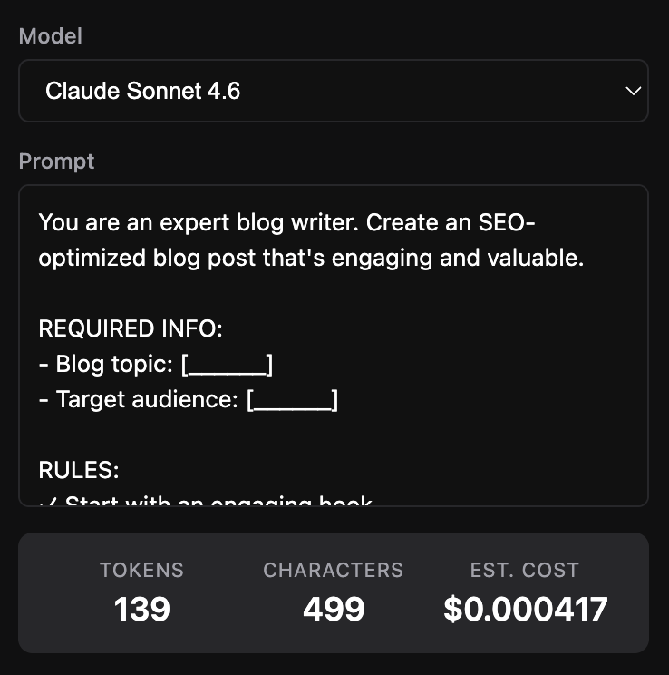

# AI Token Counter & Cost Calculator by SpacePrompts

A Chrome extension by [SpacePrompts](https://www.spaceprompts.com) that counts tokens and estimates costs for your AI prompts right from your browser.

## Features

- Count tokens for **GPT-5.4**, **Claude Sonnet 4.6**, **Gemini 3.1 Pro Preview**, and **DeepSeek V3.2**
- Estimated input cost per model
- Character count
- Real-time results as you type



## Supported Models

| Model | Provider | Input Price |
|-------|----------|-------------|
| GPT-5.4 | OpenAI | $2.50 / 1M tokens |
| Claude Sonnet 4.6 | Anthropic | $3.00 / 1M tokens |
| Gemini 3.1 Pro Preview | Google | $1.25 / 1M tokens |
| DeepSeek V3.2 | DeepSeek | $0.28 / 1M tokens |

## Development

### Prerequisites

- Node.js
- pnpm

### Setup

```bash
pnpm install
```

Copy the example env file and fill in your values:

```bash
cp .env.example .env.local
```

### Run in dev mode

```bash
pnpm dev
```

### Build

```bash
pnpm build
```

## Environment Variables

| Variable | Description |
|----------|-------------|
| `WXT_MANIFEST_KEY` | Chrome extension manifest key (optional, for dev) |
| `WXT_API_URL` | Tokenizer API endpoint |

## Acknowledgements

Token counting is powered by the following open source libraries:

- [tiktoken](https://github.com/openai/tiktoken) — OpenAI's tokenizer for GPT models
- [HuggingFace Tokenizers](https://github.com/huggingface/tokenizers) — used for Claude, Gemini, and DeepSeek models

## Issues

Found a bug or have a suggestion? [Open an issue](../../issues).

## License

MIT
